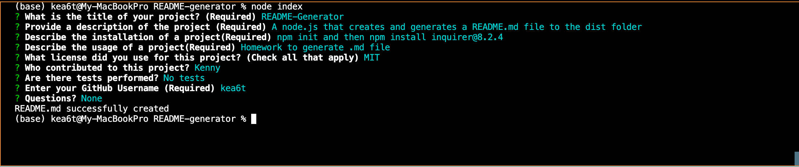

# Professional README Generator

## Description
Using node.js to generate README.md files using data from user input

Here's a link to the recorded video: https://watch.screencastify.com/v/XqkjgWbxa5fv7pITI55D

## Table of Contents
  - [Description](#description)
  - [Table of Contents](#table-of-contents)
  - [User Story](#user-story)
  - [Acceptance Criteria](#acceptance-criteria)
  - [Installation](#installation)
  - [Usage](#usage)
  - [Contributing](#contributing)
  - [Questions](#questions)

## User Story
* AS A developer
* I WANT a README generator
* SO THAT I can quickly create a professional README for a new project
## Acceptance Criteria
* GIVEN a command-line application that accepts user input
* WHEN I am prompted for information about my application repository
* THEN a high-quality, professional README.md is generated with the title of my project and sections entitled Description, Table of Contents, Installation, Usage, License, Contributing, Tests, and Questions
* WHEN I enter my project title
* THEN this is displayed as the title of the README
* WHEN I enter a description, installation instructions, usage information, contribution guidelines, and test instructions
* THEN this information is added to the sections of the README entitled Description, Installation, Usage, Contributing, and Tests
* WHEN I choose a license for my application from a list of options
* THEN a badge for that license is added near the top of the README and a notice is added to the section of the README entitled License that explains which license the application is covered under
* WHEN I enter my GitHub username
* THEN this is added to the section of the README entitled Questions, with a link to my GitHub profile
* WHEN I enter my email address
* THEN this is added to the section of the README entitled Questions, with instructions on how to reach me with additional questions
* WHEN I click on the links in the Table of Contents
* THEN I am taken to the corresponding section of the README

## Installation
* Open the command line terminal and go to the proper directory
* Install the dependencies
* Then type npm init
* Then type npm install inquirer@8.2.4

## Usage
* Type the following command to the terminal and follow through the questions
node index.js

## Contributing
:octocat: [kea6t](https://github.com/kea6t)

This was generated with ❤️ made by Kenny 🔥🌌🌳🦝

## Questions
If you have any questions :grey_question:, please send me an email at: :e-mail: Email me with any questions: k@gmail.com
